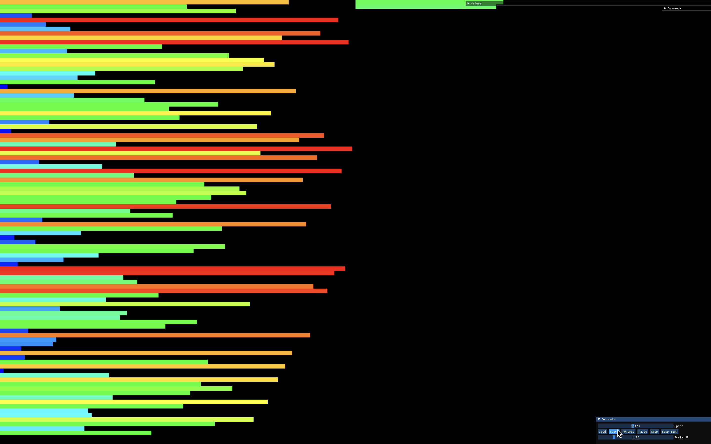
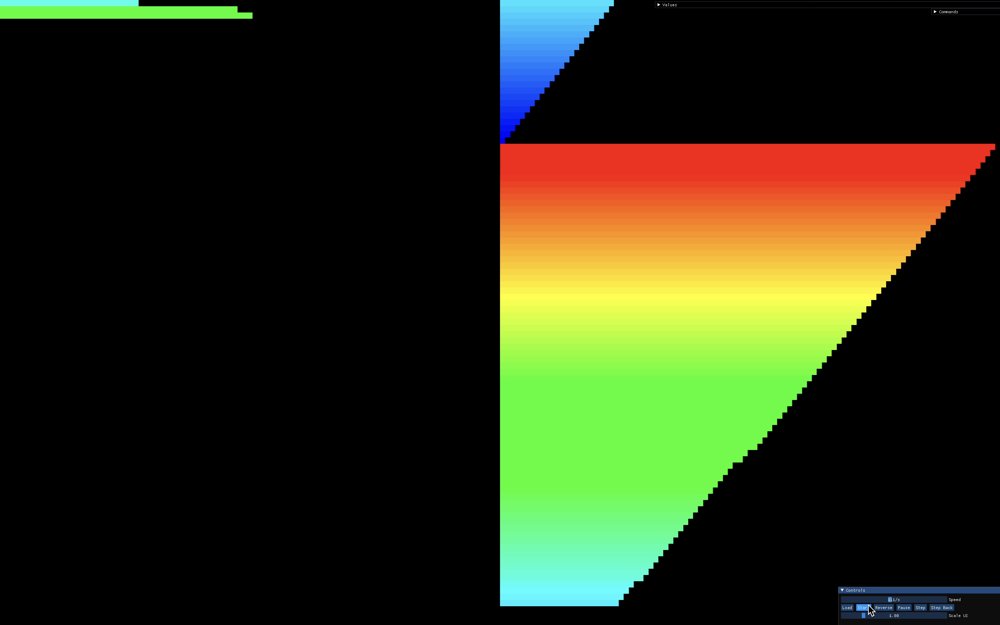

<div align="center">
  
</div>

# Content

1. [About](#about)
2. [Rules](#rules)
3. [Project](#the-project)
4. [Pseudo Code](#psuedo-code)
5. [Visualizer](#visualizer)
6. [Resources](#resources)

## About

> The project involved the development of a data sorting algorithm using a stack and a limited set of instructions. The main objective was to sort the data with the minimum number of actions possible, which required extensive knowledge of various algorithms and optimization techniques. Through this project, I gained valuable experience in algorithm design and optimization, which helped to enhance my skills as a programmer.


## Rules

- The game is composed of 2 stacks named __A__ and __B__.
- To start with:
	- A contains a random number of either positive or negative numbers without any duplicates.
	- B is empty.
- The goal is to sort in ascending order numbers into stack __A__.
- To do this, you have the following operations.

* [`sa`](ft_opt1.c) - swap __a__: swap the first 2 elements at the top of stack __a__. (do nothing if there is only one or no elements).
* [`sb`](ft_opt1.c) - swap __b__: swap the first 2 elements at the top of stack __b__. (do nothing if there is only one or no elements).
* [`ss`](ft_opt1.c) - ss: swap __a__ and swap __b__ at the same time.
* [`pa`](ft_opt1.c) - push __a__: take the first element at the top of __b__ and put it at top of __a__. (do nothing if __b__ is empty).
* [`pb`](ft_opt1.c) - push __b__: take the first element at the top of __a__ an dput it at top of __b__. (do nothing if __a__ is empty).
* [`ra`](ft_opt2.c) - rotate __a__: shift up all elements of stack __a__ by 1. the first element becomes the last one.
* [`rb`](ft_opt2.c) - rotate __b__: shift up all elements of stack __b__ by 1. the first element becomes the last one.
* [`rr`](ft_opt2.c) - rr: rotate __a__ and rotate __b__ at the same time.
* [`rra`](ft_opt3.c) - reverse rotate __a__: shift down all elements of stack __a__ by 1. the last element becomes the first one.
* [`rrb`](ft_opt3.c) - reverse rotate __b__: shift down all elements of stack __b__ by 1. the last element beoomes the first one.
* [`rrr`](ft_opt3.c) - rrr: reverse rotate __a__ and reverse rotate __b__ at the same time.

## The Project
Create two programs: ```checker``` and ```push_swap```. <br />

The ```checker``` program reads a random list of integers from the stdin, stores them, and checks to see
if they are sorted. <br />
<br />
The ```push_swap``` program calculates the moves to sort the integers – *pushing, popping, swapping* and *rotating* 
them between **stack a** and **stack b** – and displays those directions on the stdout. <br />
<br />
You can pipe ```push_swap``` into ```checker```, and ```checker``` will verify that ```push_swap```'s instructions were successful. 
<br />

Both programs must mandatorily parse input for errors, including empty strings, no parameters, 
non-numeric parameters, duplicates, and invalid/non-existent instructions.

**Push_Swap** must conform to the [42 Norm](https://cdn.intra.42.fr/pdf/pdf/960/norme.en.pdf). <br />
Using normal ```libc``` functions is strictly forbidden. Students are however, allowed to use: ```write```, ```read```, ```malloc```, ```free```, ```exit```. 
It must not have any memory leaks. Errors must be handled carefully. <br />
In no way can it quit in an unexpected manner (segmentation fault, bus error, double free, etc).

</br></br>

## Psuedo Code

</br>

1. In order to start sorting, my code pushes first two elements from top of the stack_a to the stack_b. By this way, we are creating one smallest number and one biggest number in stack_b. This is the prerequisites of my code. Because before pushing a number from stack_a to stack_b, one of the major thing the algorithm does is; comparing the number being pushed with the smallest number of stack_b and the biggest number of stack_b.



2. At this step, algorithm checks every number in stack_a. It searches the number which requires the minimum amount of operations in order to be placed at stack_b in correct spot.

3. After that, algorithm decides which number should be pushed, it calculates how many times it should rotate stack_a and how many times it should rotate the stack_b. Whicehever has the smallest number, algorithm rotates both of the stacks as the smallest number indicates. And it completes the rest of the rotates in the one single stack which ever stack required more rotate operation. You can watch how this step works in action [here](#visualizer).

4. After this, algorithm pushed the number from the top of the stack_a to top of the stack_b. Every time this spot at stack_b is correct spot for the number thanks to the previous calculations.This pushing loop continues until only three elements are left in stack_a. 

5. Algorithm quickly sorts the left three members in the stack_a.



6. Every members in stack_b one by one are being pushed to the stack_a from top to the bottom. However, it checks everytime before the elements are being pushed. This continues until the stack_b is emptied.


7. Finally, last time required amount of rotation is being applied in order to bring the smallest number on to the top of the stack_a.


</br>

## Visualizer


</br>

## Resources

- [medium - understanding push_swap](https://medium.com/@jamierobertdawson/push-swap-the-least-amount-of-moves-with-two-stacks-d1e76a71789a)
- [medium - Understanding Sorting Algorithms](https://medium.com/jl-codes/understanding-sorting-algorithms-af6222995c8)
- [medium - Best Move Algorithms](https://medium.com/@ayogun/push-swap-c1f5d2d41e97)
- [youtube - push_swap](https://www.youtube.com/watch?v=7KW59UO55TQ)
- [push_swap visualizer](https://2g2uk.csb.app)
